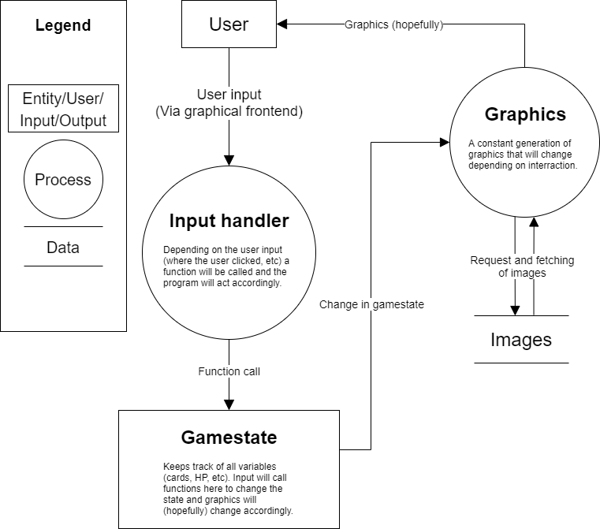

# kevinwe-faband-nhopkins-project

## Specifications

see [SPECIFICATIONS.md](https://github.com/INDAPlus20/kevinwe-faband-nhopkins-project/blob/main/SPECIFICATIONS.md)

## Structure

The structure of the program can be visualised in diagrams and flowcharts.

### Architecture

### UML diagram

