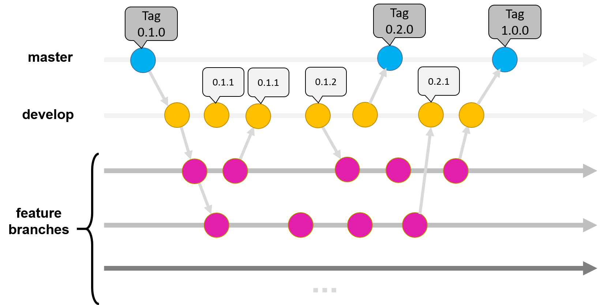

# Specifications

## Overview

* This will be an attempt at creating a card-game like [game]
    * Created with Rust :crab:
* Documentation
    * Rustdoc: https://doc.rust-lang.org/rustdoc/what-is-rustdoc.html 
* Style Guide
    * Rust Style Guide: https://github.com/rust-dev-tools/fmt-rfcs/blob/master/guide/guide.md 
* Who does what? (Preliminary roles)
    * Fabian - Graphics
    * Noah   - Head of Mechanics
    * Kevin  - Petter, Mechanics Designer (Card design? Networking?)
* Git flow:
     

## Features

* Graphics :crab:
    * GGplease
    * Create a game area (with playing field, hand, bortfall, shared deck areas etc)
    * Create graphics for cards
    * Make an interactable window (Outside console)

* Gameplay
    * Win and lose conditions
        * Out of “Player life”
        * DTC: Any other win conditions?
    * Card draw and playing
        * Draw up to hand size at the beginning of each round (after replenishment)
        * Keep between rounds
            * DTC: Discard any card at will during your round
        * Deck and hand interaction
    * Deckbuilding ("deck destroying"/"deck timing") aspects
        * All players share same deck
        * Discarded cards are returned to the bottom of the deck 
        * DTC: Buy/aquire cards from shared card pool (akin to the 'kingdom' area in Dominion) into shared deck 
        * DTC: Maybe have something (card(s)/card pools/effects/traits etc) that are tied to the specific player (instead of being shared) to enable specific builds and stratagies
    * Attacking and defending
        * Abilities
            * Cost x mana (x can be zero, consequence mana and card are considered 'depleted' until next replenish)
    * Limited card usage per turn
        * Card used each turn will be depleted ('har studerat')

* Cards
    * Categories of cards
        * Schools and sektions theme
    * Types and abilities
    * Permanent / Non-permanent cards
        * Permanent and one-time usage
    * Hitpoints and mana system
        * Hitpoints: “Studieork”
        * Rename to “Skötsamhetens poäng”

* Opponent
    * Create and design some form of opponent (AI?, Networking?, Challenges?)

* Phases of the round:
    1. Replenish permanents and mana tokens
    2. Draw cards up to hand size
    3. Play cards
    4. End turn: pass (either voluntarily or mechanically) to the next player.

## Challenges

* Coordination
* Balanced design
* Git and Rust formatting
* Graphics

## Feasibility
It seems reasonable, but maybe a bit bare. More features can always be added.

## Bottlenecks
Having a compiling program and working backend is necessary since everything relies on it.

Some funcitons, like hand and card piles will also be necessary for other functions necessary for play.
